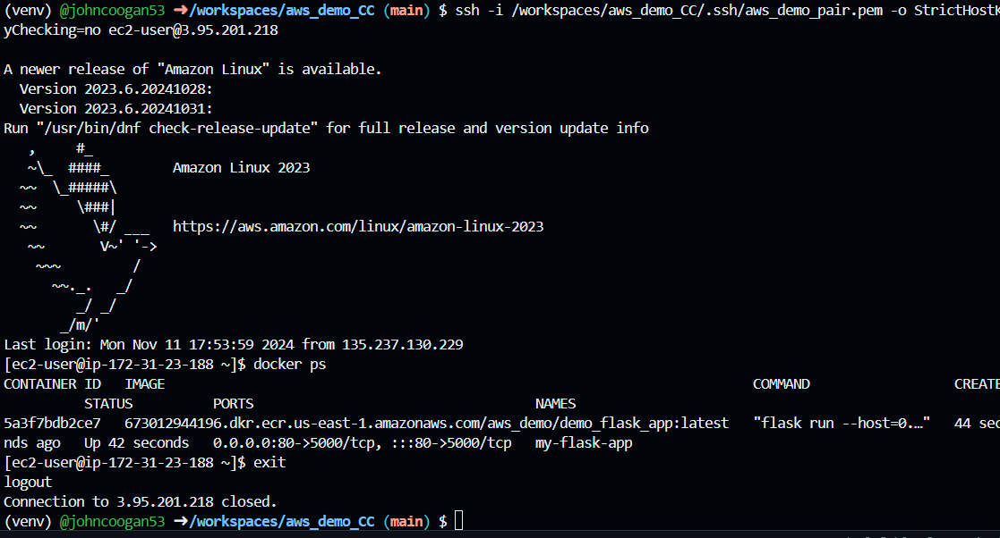

# aws_demo_CC

This demo focuses on some of the fundamental of cloud deployment. The key takeaway points are:

* Create a resource with a cloud provider (console or CLI)
* Generate permissions for that resource (IAM Keys, SSH Keys, etc.)
* Make those keys available to your application on deployment

An added concept in this demo is the use of LocalStack for local testing of cloud projects through emulated resources. 

To connect to your instance (also found on the actions for EC2)
> ssh -i /workspaces/aws_demo_CC/.ssh/aws_demo_pair.pem -o StrictHostKeyChecking=no ec2-user@3.95.201.218

To login to ECR (a lot of ecr interfacing gets managed by things like apprunner but for EC2 you do it manually)
> aws ecr get-login-password --region us-east-1 | docker login --username AWS --password-stdin 673012944196.dkr.ecr.us-east-1.amazonaws.com

To pull your image from ECR
> docker pull 673012944196.dkr.ecr.us-east-1.amazonaws.com/aws_demo/demo_flask_app:latest

> Localhost url for the containerized flask application
http://127.0.0.1:5000